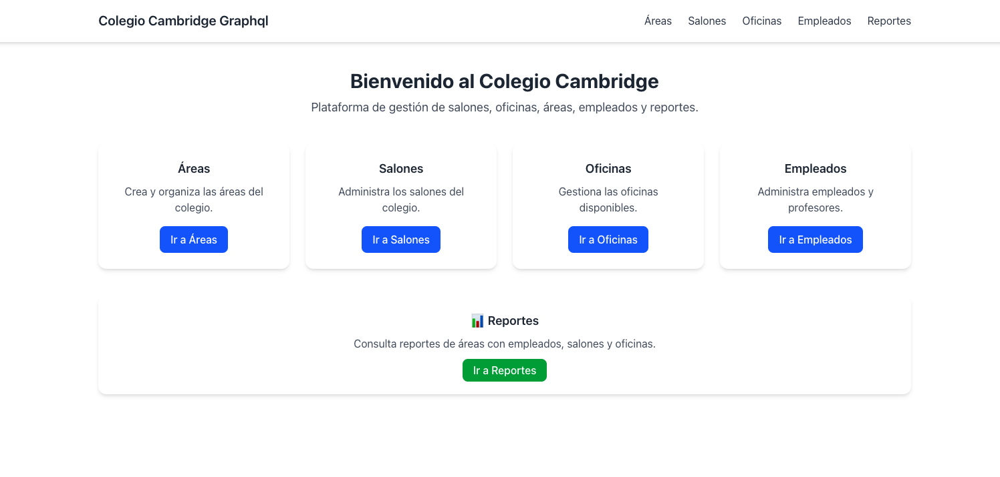

# 📚 Colegio Cambridge - Plataforma de Gestión

Este proyecto es una aplicación web para administrar la información del **Colegio Cambridge**.  
Consta de un **API (backend)** y un **frontend en React 19**.  

El sistema permite gestionar:
- 🏫 **Salones**
- 🏢 **Oficinas**
- 🌐 **Áreas**
- 👩‍🏫 **Empleados**
- 📊 **Reportes**

---

## 🚀 Tecnologías usadas

- **Frontend**: [React 19](https://react.dev/) con JSX  
- **Estilos**: [Bootstrap 5](https://getbootstrap.com/)  
- **Cliente HTTP**: [Axios](https://axios-http.com/)  
- **Ruteo**: [React Router DOM](https://reactrouter.com/)  
- **Backend (API)**: NestJS / Express  

---

## ⚙️ Instalación del frontend

1. Clona el repositorio:
   ```bash
   git clone https://github.com/sebasrl95/colegio-cambridge-front-graphql.git
   cd colegio-cambridge-frontend-graphql
   ```

2. Instala dependencias:
   ```bash
   npm install
   ```

3. Inicia el frontend:
   ```bash
   npm start
   ```

4. Asegúrate de que el **API** esté corriendo en:
   ```
   http://localhost:3000
   ```

---

## ⚙️ Instalación del backend (API)

Repositorio del API: https://github.com/sebasrl95/colegio-cambridge-api

Pasos generales:
```bash
git clone https://github.com/sebasrl95/colegio-cambridge-api.git
cd colegio-cambridge-api
npm install
npm run start
```

---

## 📂 Estructura del proyecto (frontend)

```
src/
 ├── components/
 │    ├── Home.jsx               # Pantalla principal con bienvenida
 │    ├── Navbar.jsx             # Barra de navegación
 │    ├── Loader/Loader.jsx      # Estado de carga
 │    ├── Error/ErrorMessage.jsx # Manejo de errores
 │    ├── Salones/               # Módulo de salones (listado + formulario)
 │    ├── Oficinas/              # Módulo de oficinas
 │    ├── Areas/                 # Módulo de áreas
 │    ├── Empleados/             # Módulo de empleados
 │    ├── Reportes/Reportes.jsx  # Reportes en pestañas (Áreas/Empleados, Áreas/Salones, Áreas/Oficinas)
 ├── services/                   # Servicios para consumir el API
 │    ├── api.js
 │    ├── salonService.js
 │    ├── oficinaService.js
 │    ├── areaService.js
 │    ├── empleadoService.js
 ├── App.jsx                     # Configuración de rutas
 └── index.js
```

---

## ✨ Funcionalidades principales

- **Home**
  - Bienvenida al sistema con acceso rápido a todos los módulos.

- **CRUD Salones**
  - Crear, listar, editar y eliminar salones.
  - Cada salón se asocia a un **Área**.
  - Botón de **Cancelar** en el formulario.

- **CRUD Oficinas**
  - Crear, listar, editar y eliminar oficinas.

- **CRUD Áreas**
  - Crear, listar, editar y eliminar áreas.

- **CRUD Empleados**
  - Campos: `nombre`, `documento`, `área`, `oficina`, `tipoEmpleado`, `tipoProfesor` (si aplica).
  - Soporte para empleados **administrativos** y **profesores**.
  - Precarga de área y oficina en modo edición.
  - Botón de **Cancelar** en el formulario.

- **Estados de carga y error**
  - Componente `<Loader />` con spinner de Bootstrap.
  - Componente `<ErrorMessage />` para mostrar fallas de conexión.

- **Módulo de Reportes**
  - Reporte de **Áreas y Empleados**.
  - Reporte de **Áreas y Salones**.
  - Reporte de **Áreas y Oficinas**.
  - Reportes organizados en **pestañas (Tabs de Bootstrap)**.

---

## 🖼️ Capturas

### Pantalla principal (Home)


---

## 📌 Requisitos previos

- Node.js **v20+**
- npm **v10+**
- API corriendo en `localhost:3000`

---

## 📜 Licencia

Proyecto con fines educativos - Ingeniería Informática.
